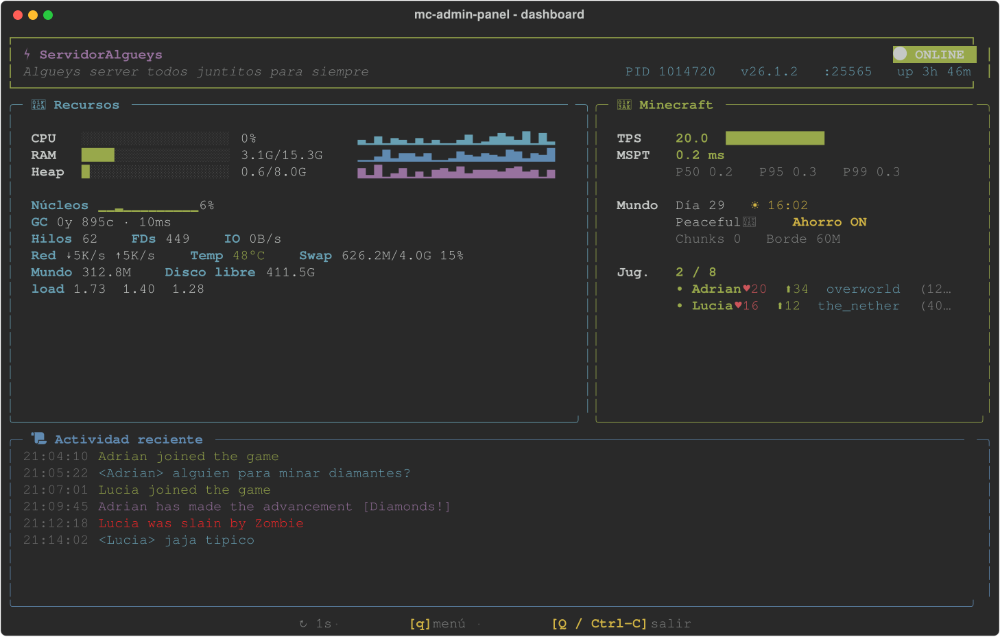
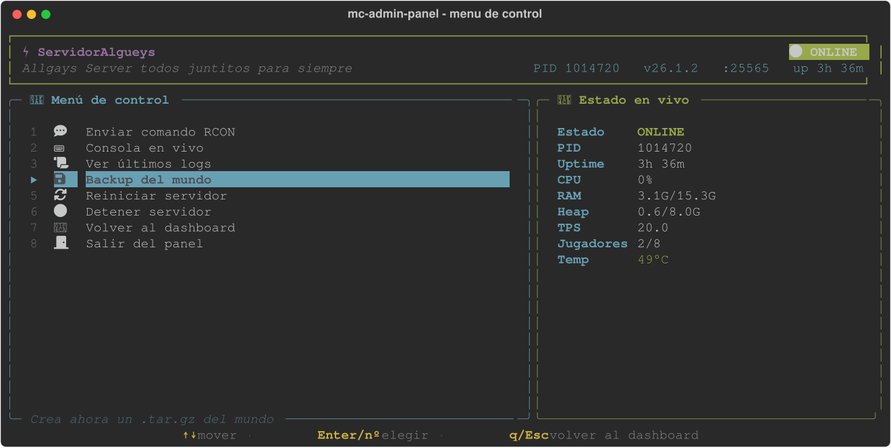

# mc-admin-panel

Panel de administración por terminal para un servidor de Minecraft en **Linux y
Windows**, con un dashboard en vivo (CPU, RAM, heap de la JVM, TPS/MSPT,
jugadores, actividad reciente...) y un menú de control integrado (comandos
RCON, consola, logs, backups, arrancar/detener/reiniciar).

Pensado para **vanilla, Paper, Purpur, Spigot o Fabric**: se instala dentro de
la carpeta raíz de tu servidor (donde está el `.jar` y `server.properties`) y
se adapta solo.

El dashboard, el ciclo de vida del servidor (arrancar/detener/reiniciar) y los
backups son Python puro y multiplataforma (`dashboard.py` + `mcadmin.py`). En
Linux el lanzador es `admin.sh` (con un menú `whiptail` de respaldo si no hay
`rich`); en Windows es `admin.bat`.

## Capturas

**Dashboard en vivo**



**Menú de control**



*(jugadores y actividad de ejemplo, para mostrar esas secciones con datos)*

## Requisitos

- **Linux o Windows.** La detección del proceso del servidor usa `psutil`
  (cwd del proceso `java`), así que funciona en los dos.
- **Python 3.** Las dependencias del panel (`rich` y, en Windows, `psutil`) las
  instala el propio lanzador en un venv local la primera vez. En Linux puedes
  reutilizar el `psutil` del sistema (p. ej. `python3-psutil`).
- Un JDK con `jcmd`/`jstat` en el `PATH` (los trae cualquier JDK normal; no
  vale un JRE recortado).
- RCON habilitado en tu servidor (ver más abajo). El panel funciona sin RCON,
  pero pierdes TPS, jugadores, consola remota y el modo ahorro.
- Solo en Linux: `whiptail` para el menú básico de respaldo (casi siempre viene
  preinstalado; si no, `apt install whiptail` / equivalente). En Windows no se
  usa: el panel siempre corre con `rich`.

## Instalación

1. Copia (o clona) los archivos de este repositorio dentro de la carpeta raíz
   de tu servidor de Minecraft, junto al `.jar` y `server.properties`.
2. En `server.properties`, asegúrate de tener:
   ```
   enable-rcon=true
   rcon.password=algo-secreto
   rcon.port=25575
   ```
3. Edita `config.sh` (es el único archivo que normalmente hay que tocar; en
   Windows se lee igual, no necesitas bash para ello):
   - `SERVER_NAME`: nombre que se muestra en el dashboard.
   - `JVM_RAM`: ajusta la memoria a tu máquina.
   - `SERVER_JAR`: déjalo vacío para autodetectarlo, o fíjalo si tienes varios
     `.jar` en la carpeta.
   - `SERVER_START_CMD`: solo si necesitas un comando de arranque distinto
     (ver "Limitaciones" más abajo).
4. Arranca el panel:
   - **Linux:**
     ```
     ./admin.sh
     ```
   - **Windows:** doble clic en `admin.bat` (o `admin.bat` desde la consola).

   La primera vez crea un entorno virtual local (`.venv-admin/`) e instala las
   dependencias (`rich`; en Windows también `psutil`). En Linux, si no hay
   conexión para instalarlo, el panel sigue funcionando en un modo básico con
   `whiptail`.

## Uso

`./admin.sh` (Linux) o `admin.bat` (Windows) abre directamente el **dashboard
en vivo**. Atajos:

- `q` / `Enter` — abrir el menú de control
- `Q` / `Ctrl-C` — salir del panel

Dentro del menú: `↑↓` para moverte, `Enter` o el número para elegir, `q`/`Esc`
para volver al dashboard. Las opciones disponibles incluyen enviar un comando
RCON, ver la consola en vivo, ver logs, hacer un backup ahora, y
arrancar/detener/reiniciar el servidor.

## Windows

El toolkit es multiplataforma: el dashboard, el ciclo de vida del servidor y
los backups son Python puro (`dashboard.py` + `mcadmin.py`), así que en Windows
funcionan igual que en Linux. Lo único distinto son los lanzadores: en lugar de
los scripts `*.sh` se usan los `*.bat`.

**Requisitos en Windows**

- [Python 3](https://www.python.org/downloads/) en el `PATH` (marca *"Add
  Python to PATH"* al instalar).
- Un JDK con `java`, `jcmd` y `jstat` en el `PATH` (cualquier JDK normal; un
  JRE recortado no trae `jcmd`/`jstat`).
- Opcional pero recomendado: RCON habilitado en `server.properties` (igual que
  en Linux) para TPS, jugadores, consola remota y modo ahorro.

**Inicio rápido**

1. Copia los archivos del toolkit dentro de la carpeta raíz de tu servidor
   (junto al `.jar` y `server.properties`).
2. Edita `config.sh` (en Windows también se lee; no necesitas bash) — al menos
   `SERVER_NAME` y `JVM_RAM`.
3. Doble clic en **`admin.bat`** (o ejecútalo desde `cmd`/PowerShell). La
   primera vez crea el venv local `.venv-admin\` e instala `rich` y `psutil`;
   las siguientes arranca directo en el dashboard.

**Equivalencias de comandos**

| Tarea                       | Linux                  | Windows                  |
| --------------------------- | ---------------------- | ------------------------ |
| Abrir el panel              | `./admin.sh`           | `admin.bat`              |
| Backup del mundo            | `./backup.sh`          | `backup.bat`             |
| Lanzar el servidor directo  | `./start.sh --direct`  | `iniciar_windows.bat`    |
| Ejecutar los tests          | `./tests/run_tests.sh` | `tests\run_tests.bat`    |
| Arranque automático         | `sudo ./install-service.sh` (systemd) | Programador de tareas / [NSSM](https://nssm.cc/) (ver abajo) |

**Notas**

- La temperatura de CPU y el `load average` solo se muestran donde el SO los
  expone (típicamente Linux); en Windows aparecen como "—". Todo lo demás
  (CPU, RAM, heap de la JVM, GC, TPS/MSPT, jugadores, disco...) funciona igual.
- Los archivos de runtime (PID, `console.log`) van a `%TEMP%\mc-admin\...` en
  vez de `/tmp/mc-admin/...`.
- El servidor se lanza desacoplado de la ventana del panel, así que puedes
  cerrar el panel sin tumbar el servidor (igual que en Linux).

## Arranque automático

### Linux (systemd, opcional)

Para que el servidor arranque solo al encender la máquina y se reinicie si se
cae:

```
sudo ./install-service.sh
```

El nombre del servicio se deriva del nombre de la carpeta (p. ej.
`minecraft-miservidor`), para poder instalar varias instancias en la misma
máquina sin que choquen entre sí. Esto también instala un timer de backup
automático cada 6 horas y rotación de logs. Al terminar, el script imprime los
comandos `systemctl`/`journalctl` exactos a usar.

### Windows

No hay instalador automático, pero puedes usar el **Programador de tareas**
(Task Scheduler) para lo mismo:

- Arranque al iniciar sesión: crea una tarea que ejecute
  `mcadmin.py --do-start` con el Python del venv
  (`.venv-admin\Scripts\python.exe`) y "Iniciar en" la carpeta del servidor.
- Backups periódicos: otra tarea, p. ej. cada 6 horas, que ejecute
  `backup.bat`.

(Para un servicio real que reinicie el proceso si se cae, una herramienta como
[NSSM](https://nssm.cc/) envolviendo `mcadmin.py --do-start` funciona bien.)

## Backups

`./backup.sh` (Linux) o `backup.bat` (Windows) comprime el mundo (el nombre de
carpeta se lee de `level-name` en `server.properties`, no se asume "world") a
`backups/world-FECHA.tar.gz`, pausando el autoguardado mientras tanto si RCON
está disponible. Se conservan los `MAX_BACKUPS` más recientes (configurable en
`config.sh`); también se puede lanzar desde el menú del panel.

## Modo ahorro

Si el servidor lleva varios minutos vacío (`IDLE_TIMEOUT` en `config.sh`, 5
minutos por defecto), `idle-monitor.py` baja la dificultad a pacífico y
desactiva mobs/clima/random ticks para consumir menos CPU, y lo restaura en
cuanto entra alguien. Se puede desactivar con `IDLE_ENABLED=false` en
`config.sh`. Necesita RCON.

## Tests

- **Linux:** `./tests/run_tests.sh` — corre la suite completa (funciones de
  `lib.sh` en bash y los módulos Python).
- **Windows:** `tests\run_tests.bat` — corre la suite Python (el núcleo
  multiplataforma se cubre con `test_mcadmin.py`; `test_lib.sh` es solo para
  los ayudantes en bash de Linux).

Todo se prueba contra directorios temporales y, cuando hace falta un proceso
`java` o un servidor RCON, se levanta uno falso/sintético — no toca tu
servidor real ni necesita que esté arrancado.

## Limitaciones conocidas

- Pensado para servidores de un solo `.jar` lanzado con
  `java -jar archivo.jar nogui` (vanilla/Paper/Purpur/Spigot/Fabric). El
  Forge/NeoForge moderno arranca con un script (`run.sh` en Linux / `run.bat`
  en Windows) generado por el instalador; en ese caso define
  `SERVER_START_CMD` en `config.sh` (p. ej. `"./run.sh nogui"`) en vez de
  depender de la autodetección de jar.
- La detección de la versión del servidor en el dashboard es "best effort"
  (mira la carpeta `versions/`, típica de Fabric); si no la encuentra,
  simplemente no la muestra.
- La temperatura de CPU y el `load average` solo se muestran donde el SO los
  expone (típicamente Linux); en Windows esos dos campos aparecen como "—".

## Licencia

MIT — ver [LICENSE](LICENSE).
